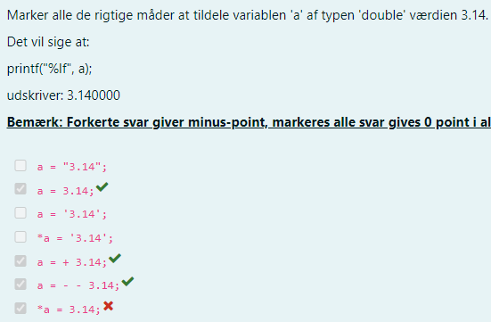

# IMPR-Notes
Notes for IMPR exam - mostly the stuff I'm a bit unsure off

## IMPR notes

- 1 Hjælpemidler: Contents
   - 1.1 Tilladte hjælpemidler:
   - 1.2 Ikke tilladte hjælpemidler:
- 2 Honorable mentions:
   - 2.1 Læs spørgsmålet flere gange, og forstå:
- 3 Pointers
   - 3.1 Declaring a pointer:
   - 3.2 Assigning addresses to Pointers
   - 3.3 Changing Value Pointed by Pointers
   - 3.4 Printing a variable and it’s memory address:
- 4 Arrays & pointers:
   - 4.1 Print addresses of array elements:
- 5 Memory Allocation
   - 5.1 malloc
   - 5.2 calloc
   - 5.3 realloc
- 6 Structs:
   - 6.1 Pointers to structs:
   - 6.2 Dynamically allocating structs:
- 7 Files
   - 7.1 Read & Write modes


## 1 Hjælpemidler: Contents

### 1.1 Tilladte hjælpemidler:

- At konsultere egen kode produceret på github.com.
- At konsultere kursets slides og kodestumper på Moodle og github.com.
- At medbringe og bruge kursets bog.

### 1.2 Ikke tilladte hjælpemidler:

- Video eller lydmateriale.
- Brug af kompilere, linter, syntakschecker eller andre værktøjer til
    at assistere med at skrive kode, det inkludere blandt andet Visual
    studio, CLion, emacs, gcc, clang og lignende af online værktøjer.
- Interaktive hjælpemidler.
- Kommunikation med andre.
- Brug af online ressourcer der IKKE er af egen produktion.


## 2 Honorable mentions:

### 2.1 Læs spørgsmålet flere gange, og forstå:


Læs opgaverne godt igennem, og forstå - eksamenssættet er eksplicit i
hvad der står eksempel, fra Mini-eksamenssæt:

Vi bliver bedt tidlele variablen ’a’ typen double med en værdi af 3,14.
Fejlen her, er at der blev antaget at vi også skulle vise det for en pointer.
Men som vi kan se i "printf()" så er a, **ikke** en pointer, og vi kan derfor
antage, at vi **kun** skal vise det for "int a ="


## 3 Pointers

### 3.1 Declaring a pointer:
```
1 int* x;
2 //Here, we have declared a pointer x of int type.
3
4 //You can also declare pointers in these ways.
5
6 int *x1;
7 int* x2 ;
8 //Let’s take anoth er example of declaring pointers.
9
10 int* x1, x2;
11 //Here , we have declared a pointer x1 and a normal variable x2.
```
### 3.2 Assigning addresses to Pointers

```
1 int* pc, c;
2 c = 5;
3 pc = &c;
4 //Here, 5 is assigned to the variable 'c'. And, the address of c is assigned to the pointer.
```
### 3.3 Changing Value Pointed by Pointers

```
1 int* pc, c;
2 c = 5;
3 pc = &c;
4 c = 1;
5 printf("%d", c); // Output : 1
6 printf("%d", *pc); // Ouptut : 1
7 //We have assigned the address of c to the pc pointer.
8
9 //Then, we changed the value of c to 1. Since pc and the address of c is the same, *pc gives us 1.
```

### 3.4 Printing a variable and it’s memory address:
```
1 #include <stdio.h>
2 int main()
3 {
4   int var = 5;
5   printf("var: %d\n", var);
6
7 // Notice the use of & before var
8   printf("address of var: &p", &var);
9   return 0;
10 }
```
```
Output:
var: 5
address of var: 2686778
```
## 4 Arrays & pointers:

### 4.1 Print addresses of array elements:
```
1 #include <stdio.h>
2 int main(){
3   int x [4];
4   int i;
5
6   for (i = 0; i < 4; ++9){
7    printf("&x[%d] = %p\n = %p\n " , i , &x [ i ] ) ;
8   }
9
10   printf("Address of array X: %p", x);
11
12   return 0;
13 }
```
```
Outputs: &x[0] = 1450734448
&x[1] = 1450734452
&x[2] = 1450734456
&x[3] = 1450734460
Address of array x: 1450734448
```
There is a difference of 4 bytes between two array elements. It is be-
cause the size of int is 4 bytes. The address of &x[0] and x is the same. It’s
because the variable name x points to the first element of the array.
```
1 //Here, we have decalred an array 'x' of 6 elements. To access elements of the array
  elements of the array, we have used pointers.
2 #include <stdio.h>
3 int main()
4 {
5   int i, x[6], sum = 0;
6
7   printf("Enter 6 numbers: ");
8
9   for(i = 0; i < 6; ++i) {
10  //Equivalent to scanf("%d", &x [i]);
11  scanf("%d", x+i);
12
13   //Equivalent to sum += x[i]
14   sum +=*(x+i);
15  }
16
17  printf("Sum = %d", sum);
18
19  return 0;
20 }
```
```
Output: Enter 6 numbers: 2
3
4
4
12
4
Sum = 29
```
```
1 //In this example, &x[2], the address of the third element, is assigned to the ptr pointer.
 Hence , 3 was dispayed when we printed the *ptr.
2 //printing *(ptr+1) gives us the fourth element. Similarly, printing *(ptr-1) gives us the second element.
3 #include <stdio.h>
4 int main() {
5
6  int x[5] = {1, 2, 3, 4, 5};
7  int* ptr;
8
9  //ptr is assigned the address of the third element
10  ptr = &x[2]; 
11
12  printf("*ptr = %d \n", *ptr); // 3
13  printf("*(ptr+1) = %d \n", *(ptr+1)); // 4
14  printf("*(ptr-1) = %d", *(ptr-1));  // 2
15
16  return 0;
17 }
```
## 5 Memory Allocation

### 5.1 malloc


The name "malloc" stands for memory allocation.
The malloc() function reserves a block of memory of the specified num-
ber of bytes. And, it returns a pointer of void which can be casted into
pointers of any form.
```
1 //This allocates 400 bytes of memory. Because the size of a float is 4 bytes.
    And, the pointer ptr holds the address of the first byte in the allocated memory.
2
3 ptr = (float*) malloc(100 * sizeof(float));
4 //Results in a NULL pointer if the memory cannot be allocated.
```
### 5.2 calloc


The name "calloc" stands for contiguous allocation.

```
The malloc() function allocates memory and leaves the memory unini-
tialized, whereas the calloc() function allocates memory and initializes all
bits to zero.
1 //allocates contiguous space in memory for 25 elements of type float.
2 ptr = (float*) calloc(25, sizeof(float));
```
### 5.3 realloc

```
If the dynamically allocated memory is insufficient or more than required,
you can change the size of previously allocated memory using the realloc()
function.
1 ptr = (int*) malloc(10 * sizeof(int));
2
3 ptr = realloc(ptr, 20 * sizeof(int));
4 //Here, ptr is reallocated with a new size 20.
```
## 6 Structs:

### 6.1 Pointers to structs:
```
1 #include <stdio.h>
2 struct person
3 {
4    int age;
5    float weight;
6 };
7
8 int main()
9  {
10    struct person *personPtr, person1;
11    personPtr = &person1;   
12
13    printf("Enter age: ");
14    scanf("%d", &personPtr->age);
15
16    printf("Enter weight: ");
17    scanf("%f", &personPtr->weight);
18
19    printf("Displaying:\n");
20    printf("Age: %d\n", personPtr->age);
21    printf("weight: %f", personPtr->weight);
22
23    return 0;
24 }
```
The address of person1 is stored in the personPtr pointer using personPtr
= &person1;.
Now, you can access the members of person1 using the personPtr
pointer.
personPtr->age is equivalent to *personPtr.age personPtr->weight is
equivalent to *personPtr.weight

### 6.2 Dynamically allocating structs:
```
1 #include <stdio.h>
2 #include <stdlib.h>
3 struct person {
4    int age;
5    float weight;
6    char name[30];
7 };
8
9 int main()
10 {
11   struct person *ptr;
12   // allocating memory for 50 numbers of struct person
13   ptr = (struct person*) malloc(50 * sizeof(struct person));
14 }

```
This allocates 50 slots for the variable ptr

## 7 Files

### 7.1 Read & Write modes


  
| Mode| Meaning of mode | During Inexistence of file |
| ----------- | ----------- | -----------|
| r | Open for reading | If the file does not exist, fopen() returns NULL. |
| rb | Open for reading in binary mode. | If the file does not exist, fopen() returns
NULL |
| w | Open for writing. | If the file exists, its contents are overwritten.
If the file does not exist, it will be created |
| wb | Open for writing in binary mode. | If the file exists, its contents are overwritten.
If the file does not exist, it will be created. |
| a | Open for append. Data is added to the end of the file. | If the file does not exist, it will be created. |
| ab | Open for append in binary mode. Data is added to the end of the file. | If the file does not exist, it will be created. |
| r+ | Open for both reading and writing. | If the file does not exist, fopen() returns
NULL. |
| rb+ | Open for both reading and writing in binary mode | If the file does not exist, fopen() returns
NULL. |
| w+ | Open for both reading and writing. | If the file exists, its contents are overwritten.
If the file does not exist, it will be created. |
| wb+ | Open for both reading and writing in binary mode. | If the file exists, its contents are overwritten.
If the file does not exist, it will be created. |
| a+ | Open for both reading and appending. | If the file does not exist, it will be created. |
| ab+ | Open for both reading and appending in binary mode | If the file does not exist, it will be created. |

r Open for reading

```
If the file does not exist, fopen() returns
NULL.
```
rb Open for reading
in binary mode.

```
If the file does not exist, fopen() returns
NULL
```
w Open for writing.

```
If the file exists, its contents are overwritten.
If the file does not exist, it will be created.
```
wb

```
Open for writing
in binary mode.
```
```
If the file exists, its contents are overwritten.
If the file does not exist, it will be created.
```
a

```
Open for append.
Data is added to
the end of the file.
```
```
If the file does not exist, it will be created.
```
ab

```
Open for append
in binary mode.
Data is added to
the end of the file.
```
```
If the file does not exist, it will be created.
```
r+

```
Open for both
reading and writ-
ing.
```
```
If the file does not exist, fopen() returns
NULL.
```
rb+

```
Open for both
reading and writ-
ing in binary
mode.
```
```
If the file does not exist, fopen() returns
NULL.
```
w+

```
Open for both
reading and writ-
ing.
```
```
If the file exists, its contents are overwritten.
If the file does not exist, it will be created.
```
wb+

```
Open for both
reading and writ-
ing in binary
mode.
```
```
If the file exists, its contents are overwritten.
If the file does not exist, it will be created.
```
a+

```
Open for both
reading and ap-
pending.
```
```
If the file does not exist, it will be created.
```
ab+

```
Open for both
reading and ap-
pending in binary
mode.
```
```
If the file does not exist, it will be created.
11
```
